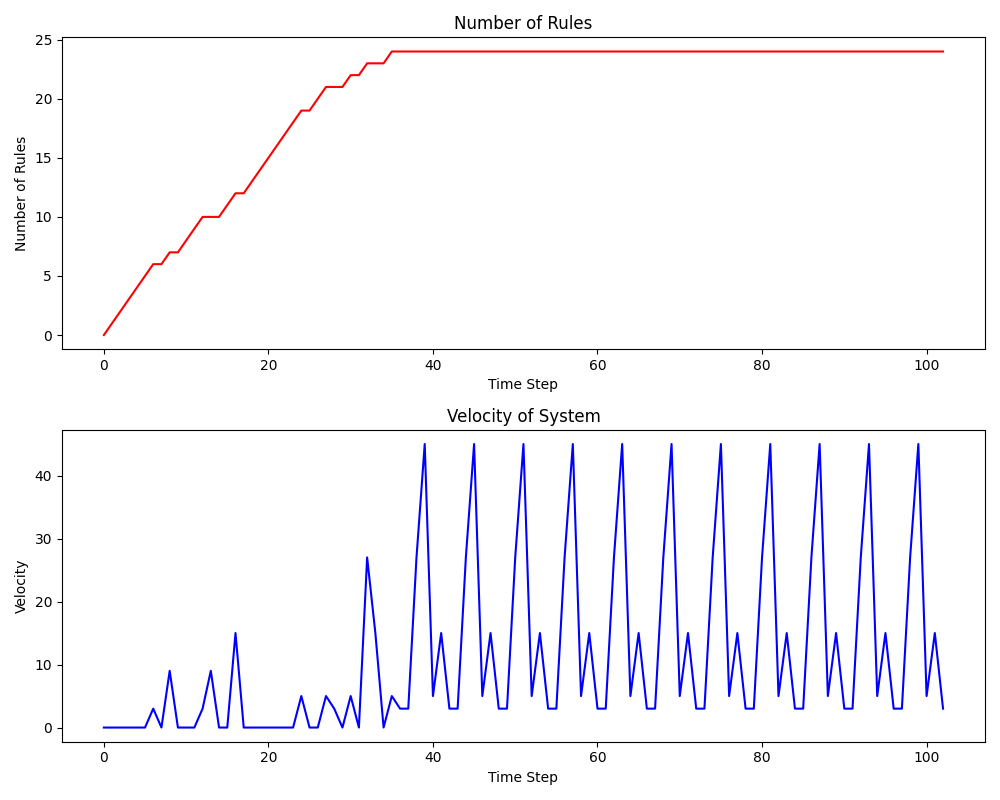
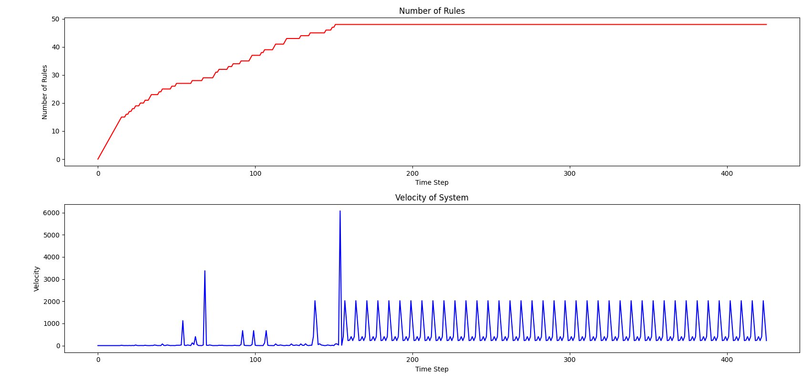

# Complex Billiards
The driver is currently set to perturb the simulation and add a new, random rule each time the global velocity of the system settles to 0

# Rules
Rules are what make the billiards complex. Each rule is a tuple (ball*vec, ball*vec). When an event occurs corresponding to the left hand side of the tuple, the right hand side is applied to the next movement buffer

# To-DO
With the current iteration, the system will eventually settle into a steady or periodic state where no more rules are created. 

I am hoping to be able to create a chaotic system that never falls into a periodic state.

The goal is to create a complex system generator from which I can practice doing analysis on and seeing interesting behavior from.

How do the number of rules affect the behavior of the system? How do the number of balls and the number of rules affect each other?

How many cycles in the rules can we detect and what does that mean for the periodicity of the system? Where A->B->A, or A->B->C->A, or A->B->C->D->A?

How would adding collisions affect the behaviors of the system?

# Design
The design is based on some harebrained idea I've been cooking.

The system is 2D, with dimensions: [3,5]

The system is a set of balls, each with their corresponding prime number ID: [7,11,13,17,19,23]

The system state is the [ball_id * (3**(x+1)) * (5**(y+1)), ...] so a system with two balls, one at [0,0] and the other at [2,2] would have a state of [7*3*5, 11*3*3*5*5]. Why? Not sure I can explain yet or if it even does anything for us, but it's fun.

Rules are created as follows: (ball_id*vec, ball_id*vec) where the right hand side is an event that just occured (say ball 7 moving right, 7*3) and the left hand side is an event that will occur next (say ball 11 moves down, so 11/5). This rule would then be (7*3, 11*-5)

If you can follow that ridiculous scheme, it means:
* The state is always just a list of [number of balls] whole numbers
* Velocity is literally a mathematical translation from the current state to the next state
* Moving from one state to the next is just an element-wise multiplication of the current state by the move buffer
* Applying rules to get the next state is as simple as looking at the state transition (7*3 means ball 7 moves right), and if that event is a causal event, adding the effect event to the move_buffer

# Some Results

